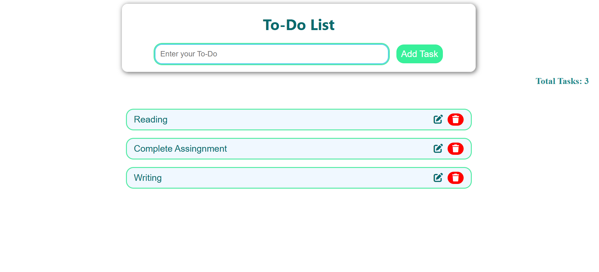

# **To-Do List App (Local Storage)**


A simple and responsive To-Do List application that stores all tasks directly in your browser using **localStorage**.
You can add, edit, delete, and track your tasks with ease. The list stays even after you refresh or close the page.

---

## **📸 Project Preview**



---

## **✨ Features**

* **Add New Tasks**
  Enter a task and add it with a button click or by pressing Enter.

* **Edit Tasks**
  Update task text through a simple prompt.

* **Delete Tasks**
  Remove tasks instantly using the delete icon.

* **Local Storage Support**
  All tasks stay saved even after closing the browser.

* **Task Counter**
  Always shows the total number of tasks.

* **Task Limit (20 tasks)**
  Prevents overload and keeps the list manageable.

---

## **📂 Project Structure**

```
📁 To-Do App
│── index.html
  │── todo.css
   │── localTodo.js
    │── README.md
```

---

## **🧠 How It Works**

### **1. Loading Tasks**

When the page opens, the script loads saved tasks from localStorage and displays them automatically.

### **2. Adding Tasks**

* Reads user input
* Validates text
* Creates a new `<li>` element
* Adds to task array
* Saves to localStorage
* Updates the counter

### **3. Editing Tasks**

* Detects clicks on the edit icon
* Opens a prompt for updated text
* Saves changes in the list and in localStorage

### **4. Deleting Tasks**

* Removes the selected task
* Filters it out from the array
* Saves the updated array
* Updates the counter

---

## **💻 Technologies Used**

* **HTML5**
* **CSS3**
* **JavaScript (ES6)**
* **Font Awesome Icons**

---

## **🚀 How to Run**

1. Download or clone the repository
2. Open **index.html** in any browser
3. Start adding tasks — no backend needed

---

## **🔮 Possible Future Enhancements**

* Mark tasks as completed
* Add priority levels
* Add search or filtering
* Drag-and-drop sorting
* Dark mode toggle
* Cloud sync

---

## **📜 License**

This project is open-source under the **MIT License**.

---
